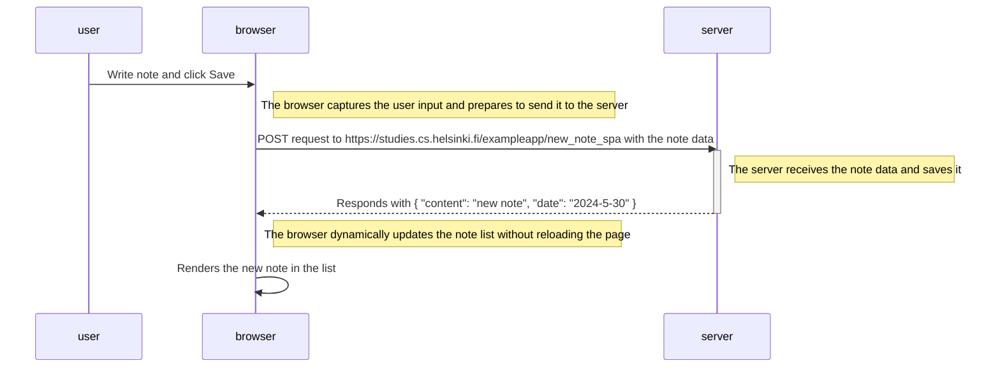

```mermaid
sequenceDiagram
    participant user
    participant browser
    participant server

    user->>browser: Write note and click Save
    Note right of browser: The browser captures the user input and prepares to send it to the server

    browser->>server: POST request to https://studies.cs.helsinki.fi/exampleapp/new_note_spa with the note data
    activate server
    Note right of server: The server receives the note data and saves it
    server-->>browser: Responds with { "content": "new note", "date": "2024-5-30" }
    deactivate server

    Note right of browser: The browser dynamically updates the note list without reloading the page
    browser->>browser: Renders the new note in the list
```