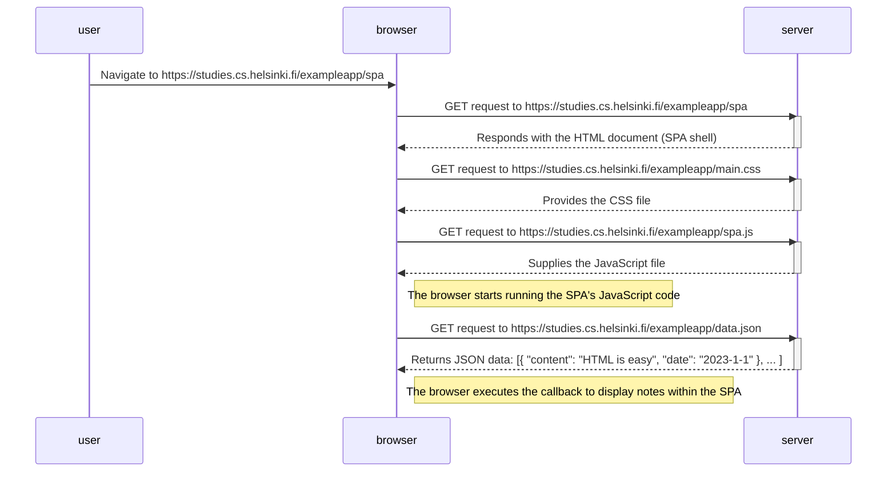

```mermaid
sequenceDiagram
    participant user
    participant browser
    participant server

    user->>browser: Navigate to https://studies.cs.helsinki.fi/exampleapp/spa
    browser->>server: GET request to https://studies.cs.helsinki.fi/exampleapp/spa
    activate server
    server-->>browser: Responds with the HTML document (SPA shell)
    deactivate server

    browser->>server: GET request to https://studies.cs.helsinki.fi/exampleapp/main.css
    activate server
    server-->>browser: Provides the CSS file
    deactivate server

    browser->>server: GET request to https://studies.cs.helsinki.fi/exampleapp/spa.js
    activate server
    server-->>browser: Supplies the JavaScript file
    deactivate server

    Note right of browser: The browser starts running the SPA's JavaScript code

    browser->>server: GET request to https://studies.cs.helsinki.fi/exampleapp/data.json
    activate server
    server-->>browser: Returns JSON data: [{ "content": "HTML is easy", "date": "2023-1-1" }, ... ]
    deactivate server

    Note right of browser: The browser executes the callback to display notes within the SPA
```